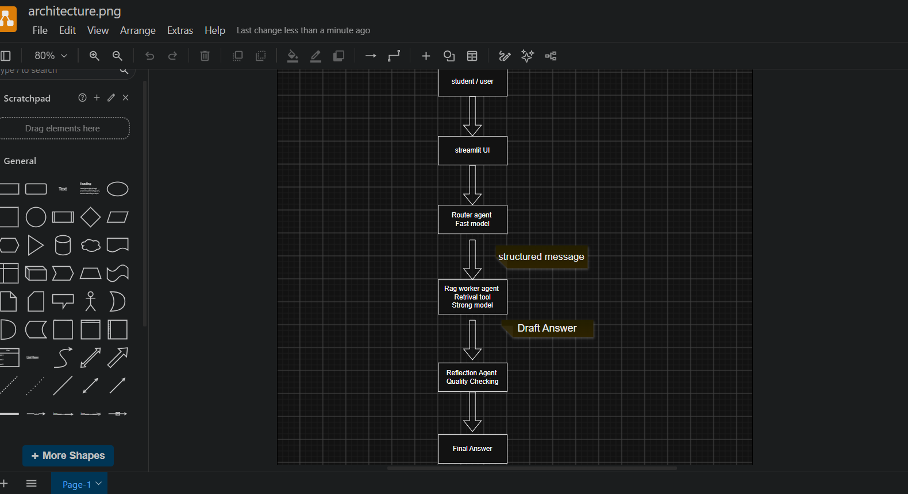

# Internship AI Assistant

## 1. Project Description
An Agentic AI system that helps university IT students with internship preparation,
CV guidance, and interview readiness using multi-agent collaboration and RAG.

## 2. Features
- Router Agent for intent detection
- RAG Worker Agent for document-based answers
- Reflection Agent for answer improvement
- Streamlit web interface

### 2.1 Agent Roles & Responsibilities

Our system utilizes three specialized AI agents to handle student queries:

1. **Router Agent**
   - **Job:** Analyzes the student's input and detects their intent (e.g., CV review, interview prep, general FAQ).
   - **Model:** Uses a fast, lightweight model (e.g., Llama 3 8B via Groq) to route queries instantly.
   - **Output:** Passes a structured instruction to the next agent.

2. **RAG Worker Agent (Researcher)**
   - **Job:** Retrieves relevant chunks from our local internship vector database and generates a detailed draft answer.
   - **Model:** Uses a powerful reasoning model (via OpenRouter) to compile high-quality answers based only on the retrieved context.

3. **Reflection Agent (Quality Control)**
   - **Job:** Reviews the draft answer generated by the Worker. It checks for correctness, ensures no hallucination, and polishes the tone before showing it to the student.
   - **Model:** Self-evaluates the output to guarantee academic safety.

## 3. Architecture Diagram
      
      

## 4. Agent Communication Flow

1. User enters a question in Streamlit.
2. Router Agent classifies intent (`cv_help`, `interview_help`, `internship_info`, `general_question`).
3. Router sends a structured message to RAG Worker Agent.
4. RAG Worker Agent retrieves relevant chunks from the vector database.
5. RAG Worker Agent generates a draft answer using retrieved context.
6. Reflection Agent reviews and improves the draft.
7. Final answer is shown in the Streamlit UI.

### Structured message example
json
{
  "intent": "cv_help",
  "query": "How do I write a CV for a software internship?",
  "needs_rag": true
}

(to be added)

## 4. Agent Communication Flow
(to be added)
 686370f3123fe8601400677c636420ae95201729

## 5. Model Selection Strategy
| Sub-task | Model | Why chosen |
|----------|-------|------------|
| Intent routing | TBD | TBD |
| Final answer generation | TBD | TBD |

## 6. RAG Pipeline
- Corpus:
- Chunking strategy:
- Embedding model:
- Vector store:
- Retrieval evaluation:

## 7. Setup Instructions
(to be added)

## 8. Live Demo
Streamlit URL: (to be added)

## 9. Design Patterns Used 
- **Router pattern** → Router Agent decides which path to use
- **Tool-use pattern** → RAG Worker uses vector DB retrieval as a tool
- **ReAct pattern** → retrieve → reason → answer
- **Reflection pattern** → Reflection Agent improves final answer

## 10. Known Limitations
- Router pattern
- ReAct pattern
- Tool-use pattern
- Reflection pattern

## 10. Known Limitations

 686370f3123fe8601400677c636420ae95201729
