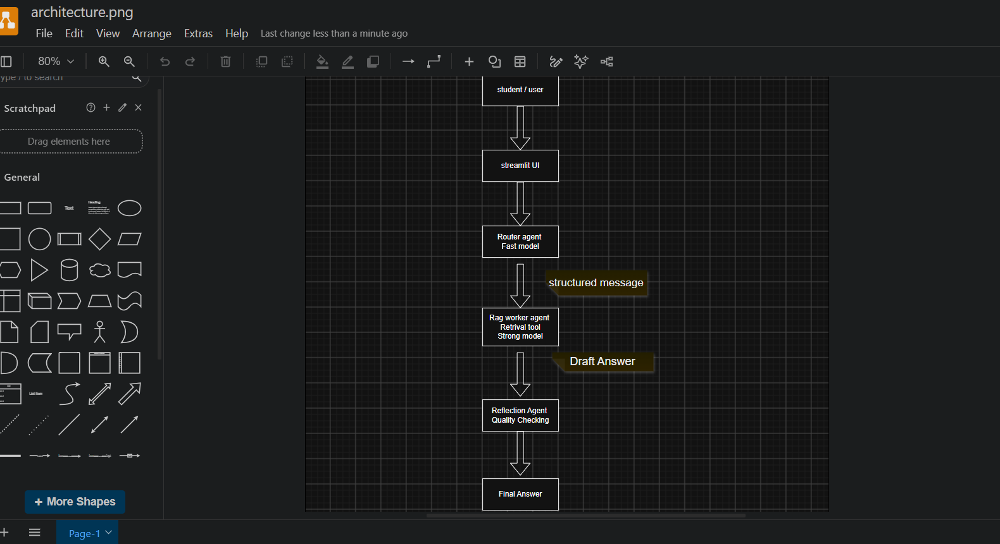

# Internship AI Assistant

## 1. Project Description
An Agentic AI system that helps university IT students with internship preparation,
CV guidance, and interview readiness using multi-agent collaboration and RAG.

## 2. Features
- Router Agent for intent detection
- RAG Worker Agent for document-based answers
- Reflection Agent for answer improvement
- Streamlit web interface

### 2.1 Agent Roles & Responsibilities

Our system utilizes three specialized AI agents to handle student queries:

1. **Router Agent**
   - **Job:** Analyzes the student's input and detects their intent (e.g., CV review, interview prep, general FAQ).
   - **Model:** Uses a fast, lightweight model (e.g., Llama 3 8B via Groq) to route queries instantly.
   - **Output:** Passes a structured instruction to the next agent.

2. **RAG Worker Agent (Researcher)**
   - **Job:** Retrieves relevant chunks from our local internship vector database and generates a detailed draft answer.
   - **Model:** Uses a powerful reasoning model (via OpenRouter) to compile high-quality answers based only on the retrieved context.

3. **Reflection Agent (Quality Control)**
   - **Job:** Reviews the draft answer generated by the Worker. It checks for correctness, ensures no hallucination, and polishes the tone before showing it to the student.
   - **Model:** Self-evaluates the output to guarantee academic safety.

## 3. Architecture Diagram
      
      

## 4. Agent Communication Flow

1. User enters a question in Streamlit.
2. Router Agent classifies intent (`cv_help`, `interview_help`, `internship_info`, `general_question`).
3. Router sends a structured message to RAG Worker Agent.
4. RAG Worker Agent retrieves relevant chunks from the vector database.
5. RAG Worker Agent generates a draft answer using retrieved context.
6. Reflection Agent reviews and improves the draft.
7. Final answer is shown in the Streamlit UI.

## 4. Agent Communication Flow

The system uses three specialized agents that exchange **structured messages** (not plain text).
 686370f3123fe8601400677c636420ae95201729

## 5. Model Selection Strategy
| Sub-task | Model | Why chosen |
|----------|-------|------------|
| Intent routing | TBD | TBD |
| Final answer generation | TBD | TBD |

## 6. RAG Pipeline
 Retrieval Evaluation

The retrieval system was tested using five sample queries. 
The top 3 retrieved chunks were inspected manually for relevance.

| Query | Result | Observation |
|---|---|---|
| How do I write a CV for an IT internship? | Partial | Two CV-related chunks were retrieved, but one internship-application chunk was also returned. |
| What are common internship interview questions? | Weak/Partial | The retrieved chunks mainly discussed internship applications rather than interview questions. |
| How should I apply for internships? | Good | Relevant content was retrieved from the internship application guide. |
| What should I include in a cover letter? | Good | Relevant cover-letter chunks were retrieved from the cover letter guide. |
| What documents are needed for internship applications? | Partial | Internship application content was retrieved, but the exact document list was not always clear. |

### Retrieval Limitation

Some queries returned partially relevant chunks. This may be caused by the small corpus size, limited chunk count, and the absence of a re-ranking step. Future improvements include adding more interview-specific documents, improving chunking, and adding a re-ranker.

## 7. Setup Instructions
 Prerequisites
- Python 3.10+ (recommended: 3.11 or 3.12)
- Git
- A free [Groq API key](https://console.groq.com)

1) Clone the repository
2) Create and activate a virtual environment
3) Install dependencies
4) Configure environment variables
5) Build the vector store (RAG knowledge base)
6) (Optional) Test retrieval quality
7) (Optional) Test agents individually
8) Run the Streamlit app locally
9) Streamlit Cloud deployment

## 8. Live Demo
Streamlit URL:  https://internship-ai-assistant-yd74qsp7c9kxsyxrmxccxg.streamlit.app/

## 9. Design Patterns Used 
- **Router pattern** → Router Agent decides which path to use
- **Tool-use pattern** → RAG Worker uses vector DB retrieval as a tool
- **ReAct pattern** → retrieve → reason → answer
- **Reflection pattern** → Reflection Agent improves final answer

## 10. Known Limitations
- Router pattern
- ReAct pattern
- Tool-use pattern
- Reflection pattern

## 10. Known Limitations

| Limitation | Impact | Possible improvement |
|-----------|--------|----------------------|
| Relatively small knowledge corpus | Answers can be thin for niche questions | Expand `data/raw/` to 20+ high-quality domain documents |
| No retrieval re-ranking | Sometimes a partially relevant chunk ranks above a better one | Add a re-ranker (cross-encoder or LLM scoring) |
| No multi-turn memory | Each question is handled independently | Add session chat history / conversation memory |
| Cold start on Streamlit Cloud | First load can take 1–3 minutes while embeddings/model initialize | Pre-build and cache the vector store more aggressively |
| Limited Sri Lanka-specific content | Advice may be generic rather than local-market specific | Add local university/company internship guides |
| English-focused corpus | Non-English queries are weaker | Add multilingual documents + multilingual embeddings |
| Free-tier LLM constraints | Rate limits or occasional latency spikes on Groq free tier | Add retry/fallback model strategy |
| PDF quality variance | Scanned/image-only PDFs extract poorly | Prefer text-based PDFs or add OCR |
| Reflection can over-edit | Final answer may become more generic than the draft | Tighten reflection prompt / keep more of the draft |
| No authentication / user accounts | Anyone with the link can use the public demo | Add auth if needed for production |

 686370f3123fe8601400677c636420ae95201729
